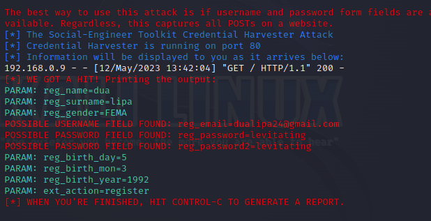

# Phishing para captura de senha 
## Ferramentas
  - Kali Linux
  - Setoolkit
## Configurando o Phishing no Terminal do Kali Linux
 - Acessando root: ``` sudo su ```
 - Iniciando o setoolkit: ``` setoolkit ```
- Escolhendo o tipo de ataque: ``` Social-Engineering Attacks ```
- Escolhendo o Vetor de ataque: ``` Web Site Attack Vectors ```
- Escolhendo Método de ataque: ```Credential Harvester Attack Method ```
  - Método de ataque: ``` Site Cloner ```
- Obtendo o endereço da máquina: ``` ifconfig ```
- URL para clone: https://www.mirtesnet.com.br/ (aqui voce pode escolher a que você quiser)


# Resultado


